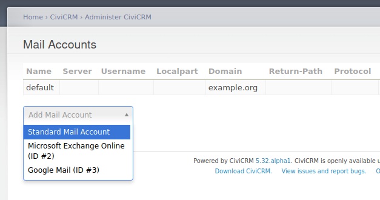
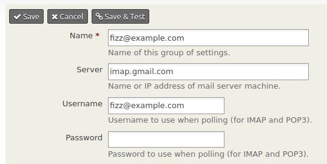

# OAuth

!!! warning "OAuth2 client support is being phased-in with CiviCRM v5.32+."

    This page discusses support for CiviCRM as an OAuth2 client. This is introduced in CiviCRM v5.32, but it is hidden by default.
    It will be more visible in future versions.

The OAuth protocols define an access-control system for Internet-based services.  Compared to traditional access-control mechanisms (like
simple password-based logins), OAuth provides more security features.  For example, it can grant limited access to specific resources, and
it can de-list devices or applications which misbehave.  These features make it well-suited to large-scale technology providers like
Google, Microsoft, or Facebook.  If you wish to have CiviCRM interact with thir API's, then you probably need to configure OAuth.

At time of writing, most implementations use OAuth version 2 (OAuth2).  We will briefly recap OAuth2 from a system-administration
perspective and then dig into some specifics.

## Primer

<!-- 
Public documentation for OAuth is largely oriented toward developers -- for example, [RFC 6749](https://tools.ietf.org/html/rfc6749) and [Digital
Ocean's tutorial](https://www.digitalocean.com/community/tutorials/an-introduction-to-oauth-2) are good documents which describe the protocol's
concepts and dataflows along with example HTTP interactions. But for sysadmins, a higher-level makes sense.
-->

As a consumer of a typical web application, you may use OAuth2 without being aware of it.  What you experience is a redirect between
different websites.  For example, you might visit the website of a small organization, *the Dolphin Defense League* (green), which acts as the
*OAuth2 client*.  It directs the user to a large technology company, *Microkookle* (yellow), which acts as the *OAuth2 provider*.


After following this pageflow, the *Dolphin* site is authorized to send API requests for *Mr. Flipper*'s information. (Specifically, the
*Dolphin* site holds an *access token*. Whenever a background process needs to work with *Mr. Flipper*'s data, it will use the token.)

In this flow, we can see a few important variables -- these are the configuration options that you will have to set as an administrator.
Let's annotate the pageflow to highlight them.


The blue circles indicate important variables:

* __Client ID__: When *Dolphin* sends the user to *Microkookle*'s authorization page, the URL includes a unique *Client ID*.

* __Scope__: When the user reviews the *Authorization page*, it shows a list of requested permissions.  This is called the "scope" of access.  Each
  permission has a visible description (e.g.  "Post to your timefeed") and an invisible machine name (e.g.  `post_feed`).

* __Redirect URL__: When the user clicks "Approve", the user is sent to the "Redirect URL" for the *Dolphin* site.

These variables will need to be matched-up.  Both the *Dolphin* site and *Microkookle* site have OAuth administration pages, and the goal
is to copy values between them. Blue fields indicate where you will typically enter information:


On a conceptual level, the configuration tasks will work the same way in most deployments:

* On the OAuth2 client, determine the "Redirect URL" and the "Scopes". Copy these to the OAuth2 provider.
* On the OAuth2 provider, determine the "Client ID" and "Client Secret". Copy these to the OAuth2 client.

In practice, the real-world pages will vary on a case-by-case basis.  If you understand the general steps, then you may be able to figure
out the details. However, we discuss a few specific cases below.

## Enable the module

The CiviCRM OAuth Client is a core extension. It was added in CiviCRM v5.32; however, it is hidden by default. You can enable it using
the command-line or the Javascript console.

??? howto "Enable via command line"

    Steps:
    
    * Open a command-line for the site. (This often requires SSH.)
    * Navigate to the site folder
    * Enable the module
    
    For example:

    ```
    ssh myserver.example.com
    cd /var/www/example.com/web
    cv en oauth_client
    ```
    
    <!-- TODO: sometime in 2021+, change `oauth_client` to `oauth-client`. The dash is more canonical. Current cv accepts either. However, older versions of cv had a bug with the dashed form.. -->

??? howto "Enable via Javascript console"

    * Login to CiviCRM backend UI. Any page in `/civicrm` will work.
    * In the web browser menu, open the Javascript console, e.g.
        * (Chrome, circa 2020): "View => Developer => Javascript Console"
        * (Firefox circa 2020): "Tools => Web Developer => Web Console"
    * Enter this command:
      ```
      CRM.api3('Extension', 'install', {keys: ['oauth-client']})
      ```

## Register the connection {:#register}

To setup a new connection, you must simultaneously configure the client-side (eg CiviCRM) and the remote provider-side (eg Google or
Microsoft).  We first discuss the CiviCRM side, and then consider a few common providers.

### CiviCRM (Client) {:#civicrm-client}

* Navigate to "Administer => System Settings => OAuth"
* Choose the relevant web-service provider (e.g. `gmail` or `ms-exchange`).
* For a new service, this will open the "Register Client" tab:

    

    * You will copy the "Redirect URL" and the list of scopes to the provider.

        ??? question "Question: What if the "Redirect URL" has a warning about HTTP(S)?"
        
            OAuth2 providers often have restrictions on what makes a valid "Redirect URL" -- they often require the use of HTTPS or (as a
            fallback) they allow HTTP on `localhost` (`127.0.0.1`) deployments.  Other hostnames and IPs may not use HTTP (*even if they
            are private or functionally equivalent*).

            Modern, public deployments of CiviCRM should be compliant.  However, many internal sites used for development or testing are
            not.  This is likely to happen with virtual-hosts, virtual-networks, and/or virtual-machines.  CiviCRM warns if the URL appears
            non-compliant.

            Here are some alternative options to work-around the restrictions for internal dev/test sites:
            
            * Enable HTTPS for the internal dev/test site.
            * Change the URL to be strictly `http://localhost:NNN` or `http://127.0.0.1:NNN`.
            * Setup an intermediate URL on `http://localhost:NNN`. The script `ext/oauth-client/bin/local-redir.sh` does this automatically.
            * Setup an intermediate URL on a public HTTPS site. Here's a hypothetical example:
                * On the public web server `https://example.com`, setup an HTTP direct:
                    * __From__: `https://example.com/my-intermediate-url`
                    * __To__: `http://my.local:8001/civicrm/oauth/return`
                * Update CiviCRM to use the intermediate URL
                    ```
                    cv api setting.create oauthClientRedirectUrl=https://example.com/my-intermediate-url
                    ```
                * Use `https://example.com/my-intermediate-url` as the "Redirect URL".

    * On the provider's web site, find or initialize the "Client ID" and "Client Secret". Paste these values into the client.
    * Click "Add".

### Google Mail (Provider) {:#gmail}

The Google Mail integration allows you to register a "Mail Account" hosted by Google for use with CiviCase or CiviMail. Some key links:

* [Google API Console](https://console.developers.google.com/)
* [Documentation: Using OAuth 2.0 to Access Google APIs](https://developers.google.com/identity/protocols/oauth2)
* [Documentation: Using IMAP, POP, and SMTP with Gmail](https://developers.google.com/gmail/imap/imap-smtp)

??? warning "Google treats IMAP as a "restricted" API."

    Google imposes more restrictions on IMAP applications than most.

    You may find that the restrictions quite acceptable if you have a custom Google Apps domain (where both the email-account and the API project are
    associated with the same domain).
    
    For other arrangements, you may find extra warnings, limits, or verificaton steps.

    See also: [OAuth API verification FAQs](https://support.google.com/cloud/answer/9110914) which discuss sensitive and restricted APIs.

After registering OAuth2 details with CiviCRM and Google, you can:

* Navigate to "Administer => CiviMail => Mail Accounts" 
* Add a specific email account.

### Microsoft Exchange (Provider) {:#ms-exchange}

The Microsoft Exchange Online integration allows you to register a "Mail Account" hosted by Microsoft for use with CiviCase or CiviMail. Some key links:

* [Microsoft Azure Portal](https://portal.azure.com/)
* [Documentation: Quickstart: Register an application with the Microsoft identity platform](https://docs.microsoft.com/en-us/azure/active-directory/develop/quickstart-register-app)
* [Documentation: Authenticate an IMAP, POP or SMTP connection using OAuth](https://docs.microsoft.com/en-us/exchange/client-developer/legacy-protocols/how-to-authenticate-an-imap-pop-smtp-application-by-using-oauth)

After registering OAuth2 details with CiviCRM and Microsoft, you can:

* Navigate to "Administer => CiviMail => Mail Accounts"
* Add a specific email account.

## Authorize access to resources

After registering the connection between the client and the provider, you need to use it!

Generally, it is ideal to integrate OAuth2 resources into other parts of the application, but that requires development work.  Let's
consider two examples --  a richer, more-developed example and a generic, less-developed example.

### Add a mail account

If you have setup an email service like "Google Mail" or "Microsoft Exchange", then:
    
* Navigate to "CiviCRM => CiviMail => Mail Accounts".
* Under "Add Mail Account", you will see an option for the email provider (eg Google or Microsoft). Click it.

    

* The browser will redirect to the Google or Microsoft login screen. Choose the desired account and approve access.
* The browser will redirect back to CiviCRM.  You will see a configuration screen with some defaults pre-populated.  

    

    ??? note "Note: Leave the password blank"

        The email account uses OAuth2 -- so it does not need a password.

At this point, you have a "Mail Account" linked via OAuth2. Consult the documentation for CiviMail and/or CiviCase
for setting additional options.

### Add a generic token

These generic steps are useful for some simple integrations, for development, and possibly for debugging.

* Navigate to "Administer => System Settings => OAuth".
* Choose the relevant web-service provider.
* You will see a list of any existing tokens. On a new configuration, this list is empty.

    

* Click "Add (Auth Code)". This will initiate an [OAuth2 Authorization Code Grant](https://tools.ietf.org/html/rfc6749#section-4.1).
  <!-- TODO: Add buttons for userPassword and clientCredential grants. -->
* The browser will redirect to the provider's site. Choose the desired account and approve access.
* The browser will redirect back to CiviCRM. You will see an *access token* was created:

    

    ??? question "What does "Inspect" do?"

        If you have high enough privileges (super-user or `manage OAuth client secrets`), then you can inspect the token.

        This reveals the raw token, which you may use to send improvised API/HTTP requests.  Additionally, if the token is based on
        [JWT](https://en.wikipedia.org/wiki/JSON_Web_Token), it can reveal any claims included with the token.

At this point, CiviCRM is storing the *access token*. However, it is inert. To *use* the token, one must develop or install a suitable extension.

<!-- TODO, When the dev guide has a page, link to it... -->

